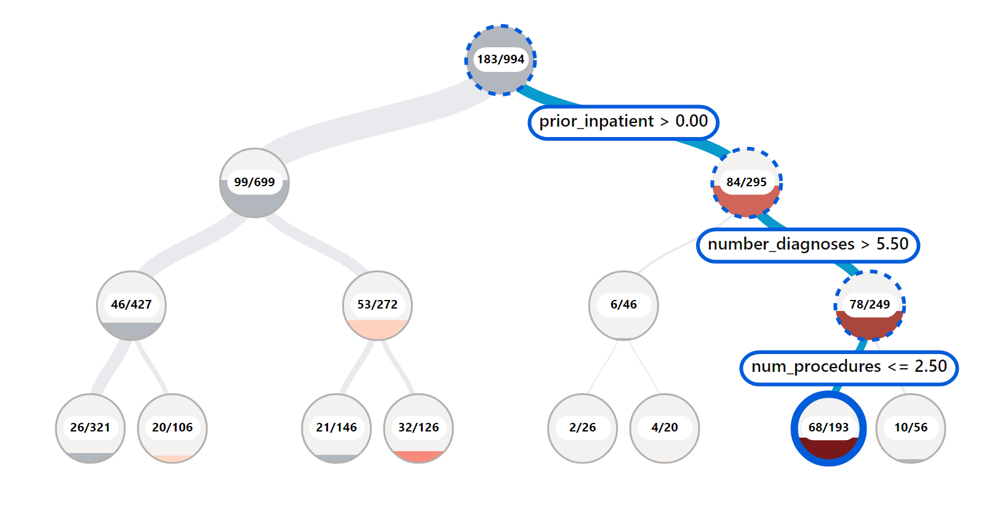
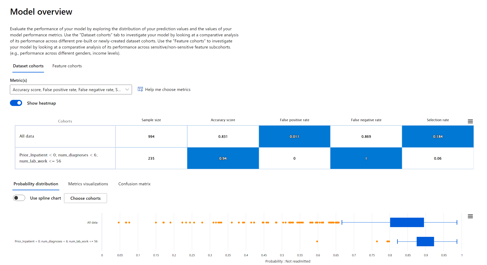
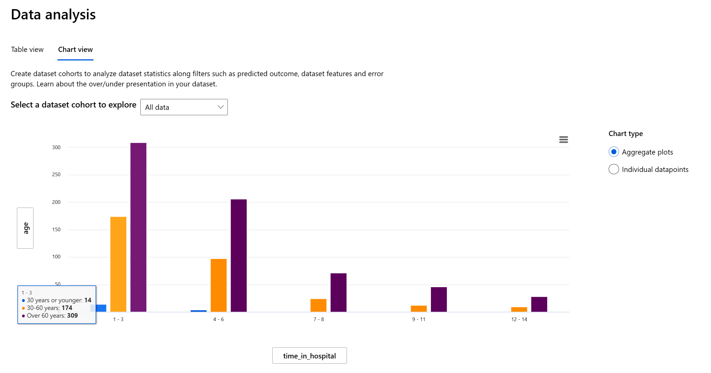
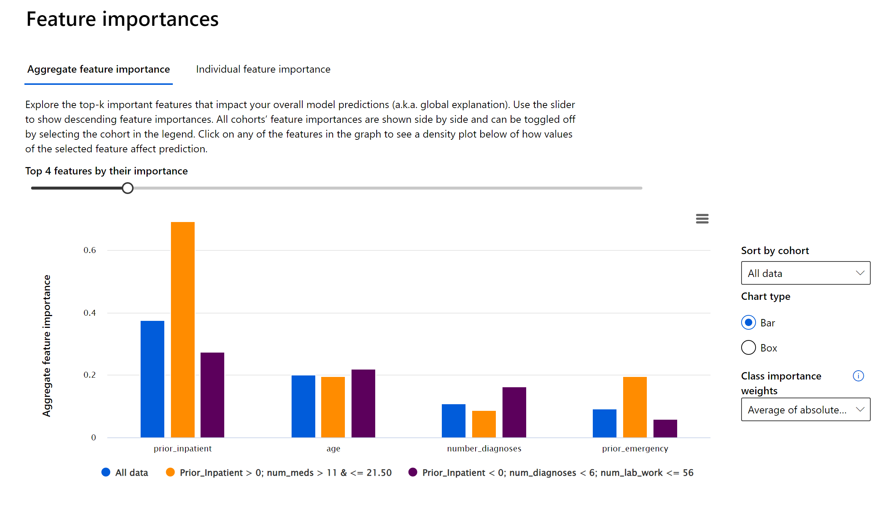

> 🎥 Click the image below for a video: Responsible AI dashboard capabilities and features

> 🎥 Click the image above for a video: Responsible AI dashboard capabilities and features

# Responsible AI Dashboard workshop 
This workshop gives you a hands on experience on how to use an the Responsible AI dashboard from Azure Machine Learn to a trained classification model for diabetes hospital readmission. The lab will walk you through the steps of training a model, deploying it and then use the dashboard to debug and assess the model for fairness, inclusiveness, transparency, accountability and reliability.

## Business Use Case Overview
The project contain data and notebook scripts to train a classification model that we’ll use to analyze and resolve issues we find using Azure Machine Learning studio's new Responsible AI (RAI) dashboard. We will be using a Diabetes Hospital Readmission dataset to predict whether a diabetic patient will be Readmitted or Not Readmitted back in a hospital < 30 days after being discharged. 

## Data
We’ll be using the [UCI's Diabetes 130-US hospitals for years 1999–2008](https://archive.ics.uci.edu/ml/datasets/Diabetes+130-US+hospitals+for+years+1999-2008#) dataset

## Prerequisites
- You do not need an Azure subscription to complete this hands-on workshop. 
- Access the Microsoft Learn module [here](https://learn.microsoft.com/en-us/training/modules/train-model-debug-with-responsible-ai-dashboard-azure-machine-learning/)

# Workshop sections

The workshop will cover the following components of the dashboard:

## How to use Error Analysis 

Traditional performance metrics for machine learning models focus on calculations based on correct vs incorrect predictions.  The aggregated accuracy scores or average error loss show how good the model is, but do not reveal conditions causing model errors. While the overall performance metrics such as classification accuracy, precision, recall or MAE scores are good proxies to help you build trust with your model, they are insufficient in locating where in data the model has inaccuracies.  Often, model errors are not distributed uniformly in your underlying dataset.  The Responsible AI dashboard uses Error Analysis helps you identify data regions where there are a high number of inaccuracies in your model that may turn out to be an important data demographic you cannot afford to ignore. 

## How to use Model Overview

Model Overview enable data scientists and AI developers to perform comparative analysis between dataset subgroups or feature values, which is vital in debugging a model to pinpoint where it’s having issues. For example, discovering that the model is more erroneous with a cohort that has sensitive features (e.g., employee age, gender or marital status) can help expose potential unfairness the model may have. The Responsible AI uses Model Overview to helpto find model performance disparities across metrics and subgroups.

## How to use Data Analysis

Data Analysis helps exposed data discrepancy that are usually a blind spot for tradition model performance metrics. The Azure Responsible AI dashboard enables you to use Data Analysis to explore and understand the dataset distributions and statistics. This is useful for ML professionals to be able to quickly debug and identify issues of data over- and under-representation and to see how data is clustered in the dataset. As a result, they can understand the root cause of errors and any fairness issues introduced via data imbalances or lack of representation of a particular data demographic.

## How to use Feature Importance

The Feature Importance section of the RAI dashboard provides an interactive user interface (UI) that enables data scientists or AI developers to see top features in their dataset that drove a model’s prediction. In addition, it provides both global explanations and local explanations. With global explanation, the dashboard displays the top features that drove the model’s overall predictions. For local explanations, on the other hand, it shows which features drove a prediction for a specific individual or data point. The drives model explainability and transparency, which are important for building trust with your model. 

# Let get started!

* Access the Microsoft Learn module [here](https://learn.microsoft.com/en-us/training/modules/train-model-debug-with-responsible-ai-dashboard-azure-machine-learning/)

# OSS technologies in the RAI dashboard

The dashboard is built on some of machine learning’s best practice open-source tools for model debugging and assessment and responsible decision making that Microsoft and research community have been instrumental in developing — including ErrorAnalysis, InterpretML, Fairlearn, DICE, and EconML, for debugging and mitigating issues from AI models.

# Additional References
- [Understanding RAI dashboard controls & settings](https://aka.ms/MBRAIdashboardControls)
- [Innovating Responsible AI: Videos, Projects, toolkits and Standards](https://www.microsoft.com/ai/ai-lab-responsible-ai-dashboard)

## Discussion
- How are you using RAI dashboard in your project?
- What is your feedback after trying out the dashboard?

