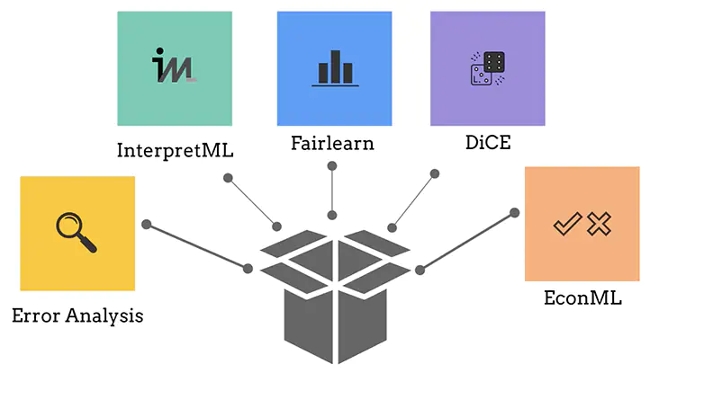

> 🎥 Click the image below for a video: Responsible AI dashboard capabilities and features

> 

> 🎥 Click the image above for a video: Responsible AI dashboard capabilities and features

# Responsible AI Dashboard workshop 
This workshop gives you a hands on experience on how to use an the Responsible AI dashboard from Azure Machine Learn to a trained classification model for diabetes hospital readmission. The lab will walk you through the steps of training a model, deploying it and then use the dashboard to debug and assess the model for fairness, inclusiveness, transparency, accountability and reliability.

## Use Case Overview
We will be using a Diabetes Hospital Readmission dataset to train a classification model that predicts whether a diabetic patient will be Readmitted or Not Readmitted back in a hospital < 30 days after being discharged. 

## Data
We’ll be using the [UCI's Diabetes 130-US hospitals for years 1999–2008](https://archive.ics.uci.edu/ml/datasets/Diabetes+130-US+hospitals+for+years+1999-2008#) dataset

## Prerequisites
- You do not need an Azure subscription to complete this hands-on workshop. 
- [Start workshop here](https://learn.microsoft.com/en-us/training/modules/train-model-debug-with-responsible-ai-dashboard-azure-machine-learning/)

# Workshop sections

Traditional performance metrics for machine learning models focus on calculations based on correct vs incorrect predictions.  The aggregated accuracy scores or average error loss show how good the model is, but do not reveal conditions causing model errors. These are insufficient in locating harms such as unfairness, bias, stereotyping or lack of representation.   

The workshop will cover the following components of the dashboard:

- How to use **Error Analysis**:  identify data regions where there are a high number of inaccuracies in your model that may turn out to be an important data demographic you cannot afford to ignore. 

- How to use **Model Overview**: find model performance disparities across metrics and subgroups which is vital in discovering if a model is more erroneous with one demographic that has sensitive features (e.g., age, gender, gender, race etc).

- How to use **Data Analysis**: exposed data discrepancy that are usually a blind spot for tradition model performance metrics. This is useful to quickly identify issues where there is  over or underrepresentation of data. This leads to fairness issues introduced via data imbalances or lack of representation of a particular data demographic.

- How to use **Feature Importance**:  identifies the top features that drove the model’s overall predictions. For local explanations, on the other hand, it shows which features drove a prediction for a specific individual or data point. The drives model explainability and transparency, which are important for building trust with your model. 

# 🚀 Let get started!

* [Start the workshop here](https://learn.microsoft.com/en-us/training/modules/train-model-debug-with-responsible-ai-dashboard-azure-machine-learning/)

## Additional References

- [Understanding RAI dashboard controls & settings](https://aka.ms/MBRAIdashboardControls)
- [Innovating Responsible AI: Videos, Projects, toolkits and Standards](https://www.microsoft.com/ai/ai-lab-responsible-ai-dashboard)

The dashboard is built on some of machine learning’s best practice open-source tools for model debugging and assessment and responsible decision making that Microsoft and research community have been instrumental in developing — including ErrorAnalysis, InterpretML, Fairlearn, DICE, and EconML, for debugging and mitigating issues from AI models.

